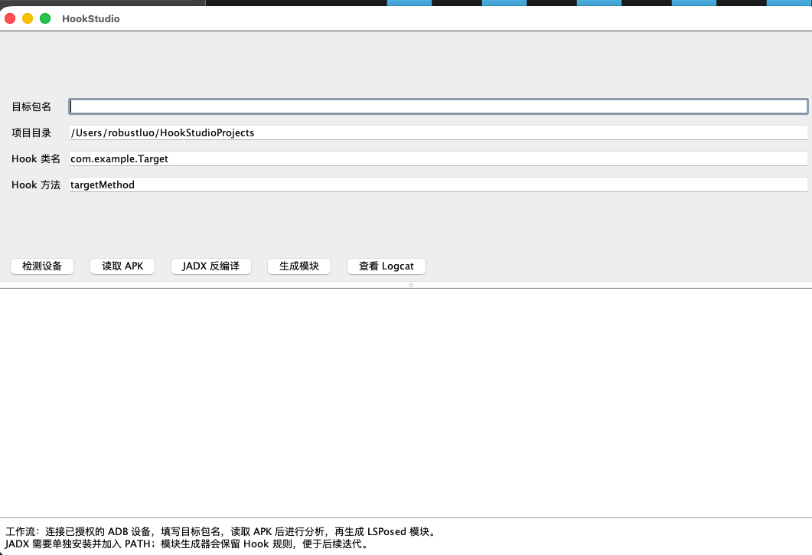

# HookStudio

<p align="center">
  
</p>

**HookStudio 是一个面向 Android 开发者和 LSPosed 用户的桌面工作台。**
它可以连接真实 Android 手机，读取已安装的 App 和 APK，调用 JADX 反编译源码，再把源码、资源、APK 和分析提示词整理成可直接交给 AI 的分析工作区，最后生成独立的 LSPosed 模块工程。



## 它能做什么

- 通过 ADB 检测手机和 USB 调试状态
- 实时读取手机已安装 App 的名称与包名
- 按 App 名称或包名搜索，避免逐个浏览大量应用
- 从设备读取目标 APK，并保存到本地项目目录
- 调用 JADX 反编译 Java/Kotlin 源码和资源
- 导出完整 AI 分析工作区，包括源码、资源、原始 APK、文件索引和 `AI_PROMPT.md`
- 根据目标包名、Hook 类名和方法名生成 LSPosed 模块工程
- 查看目标应用相关的 Logcat 日志
- 支持 macOS、Windows 和 Linux 开发环境

## 工作流程

```text
连接 Android 手机
        ↓
搜索并选择手机 App
        ↓
读取 APK
        ↓
JADX 反编译
        ↓
导出 AI 分析文件
        ↓
分析可 Hook 的类和方法
        ↓
生成 LSPosed 模块
```

## 快速开始

### 环境要求

- JDK 17 或更高版本
- Gradle 9.7.1 或更高版本
- Android Platform Tools（提供 `adb`）
- JADX，并将 `jadx` 或 `jadx.bat` 加入 `PATH`
- Android 手机已开启 USB 调试，并允许当前电脑调试

### macOS / Linux

```bash
gradle run
```

开发模式会监控源码变化，并自动重新构建和重启应用：

```bash
./dev-run.command
```

生成 macOS 应用包：

```bash
./package-macos.command
open build/macos/HookStudio.app
```

### Windows

双击 `run-windows.bat` 启动，或在终端执行：

```bat
run-windows.bat
```

生成带图标的 Windows 应用目录：

```bat
package-windows.bat
```

输出位置：

```text
build\windows\HookStudio\HookStudio.exe
```

Windows 脚本会自动尝试识别 `adb.exe` 和 `jadx.bat`。如果没有自动找到，请把 Android Platform Tools 和 JADX 的安装目录加入系统 `PATH`。

## 导出给 AI 分析

1. 点击“检测设备”。
2. 点击“选择手机 App”，搜索并选择目标应用。
3. 点击“从设备读取 APK”。
4. 点击“JADX 反编译”。
5. 点击“导出 AI 分析文件”。

软件会在桌面生成：

```text
~/Desktop/HookStudio-AI/<包名-时间>/
```

目录中包括：

- 完整反编译源码和 JADX 资源
- 原始 APK
- 文件索引和分析元数据
- `AI_PROMPT.md`，用于指导 AI 定位可 Hook 的类和方法

把这个目录交给 AI 后，可以让 AI 先分析目标逻辑，再生成独立的 LSPosed 模块源码。

## 项目结构

```text
src/main/kotlin/dev/hookstudio/Main.kt   # Swing 桌面应用和核心功能
src/main/resources/                      # 应用图标和资源
package-macos.command                    # macOS 打包脚本
package-windows.bat                      # Windows 打包脚本
.github/workflows/build.yml              # macOS / Windows / Ubuntu 自动构建
```

## 技术栈

- Kotlin/JVM
- Swing
- Gradle
- ADB
- JADX
- `jpackage`

## 使用说明

HookStudio 是 APK 分析和 LSPosed 开发辅助工具，不会自动修改手机系统或目标应用。请只分析你拥有或获授权测试的应用，并遵守当地法律、应用许可协议和隐私要求。

## 开源协议

本项目采用 [MIT License](LICENSE)。源码仓库不包含构建目录、APK 或本地分析结果。
